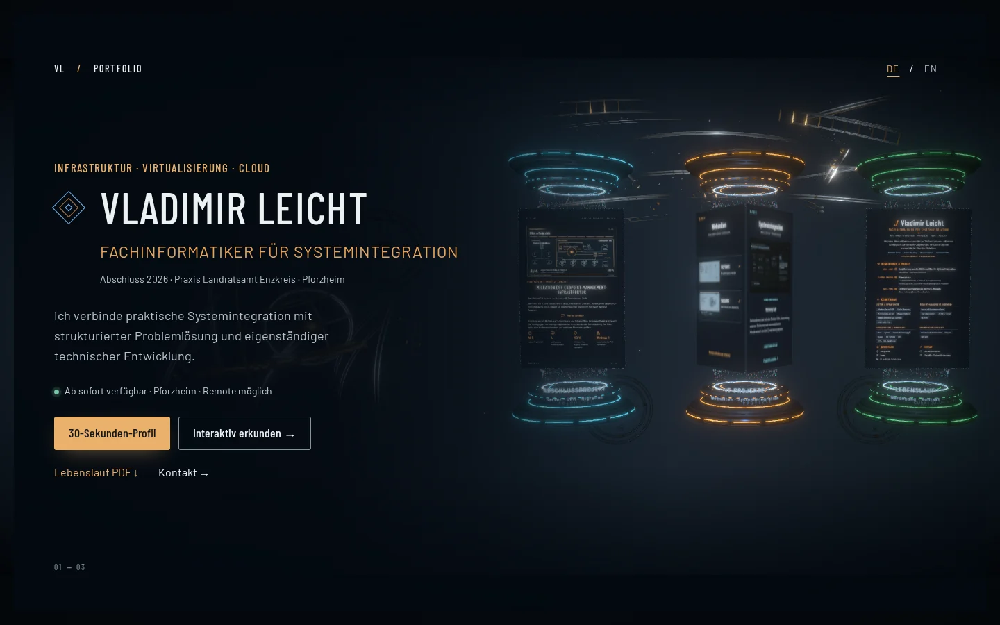
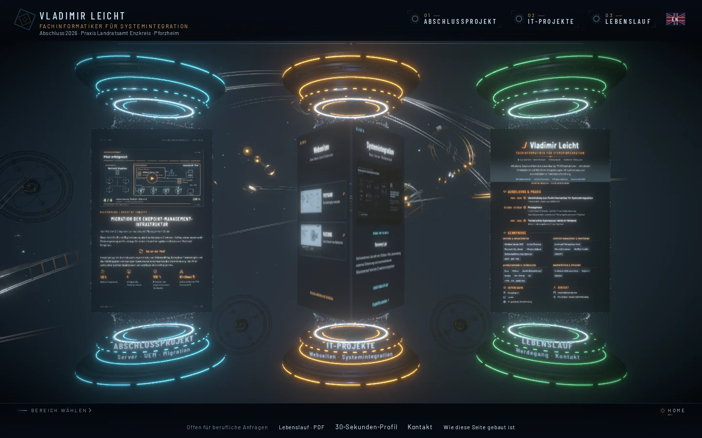
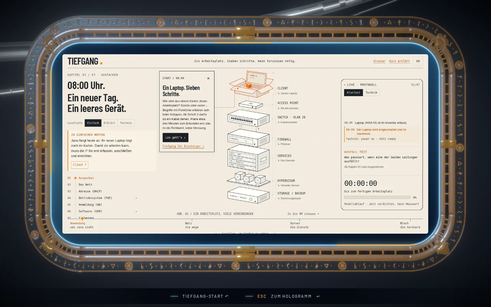

# Vladimir Leicht – Online-Präsenz

**Deutsch** · [English ↓](#english)

[vladimir-leicht.com](https://vladimir-leicht.com/) · Bewerbungswebseite eines Fachinformatikers für Systemintegration

Eine zweisprachige Bewerbungsseite in zwei Ebenen. Die **HTML-Startseite** ist sofort lesbar und enthält
Kurzprofil, Kontakt und Lebenslauf. Der **3D-Raum** zeigt Abschlussprojekt, IT-Projekte und Lebenslauf als
Hologramme über drei Sockeln vor einem mechanischen Orrery. Alle Inhalte bleiben auch ohne WebGL, per
Tastatur und mit reduzierter Bewegung erreichbar.



| 3D-Raum | Beispielseite im Portal |
| --- | --- |
|  |  |

## Inhalte

- **Startseite, 30-Sekunden-Profil und Kontakt:** echtes HTML mit Glossar, Fokusführung und Scanlinie.
- **Abschlussprojekt (IHK):** Migration der Endpoint-Management-Infrastruktur (Matrix42 Empirum →
  baramundi). Die Dokumentation ist ein scrollbares Hologramm mit eingebettetem Projektfilm.
- **IT-Projekte:** Der mittlere Sockel öffnet zwei Flügel. Jede Beispielseite ruft eine Portalmaschine auf, die
  auf einer eigenen Bahn des Orrery mitfährt: Die Kamera fliegt hin, die Maschine entfaltet sich zum Rahmen, und die
  Seite erscheint darin, während das Orrery dahinter weiterzieht.
  - [Tiefgang](https://vladimir-leicht.com/beispiel/) zeigt interaktiv, wie ein Arbeitsplatz entsteht
    (DHCP, PXE, AD, UEM), mit Vektorzeichnung und Lesetiefen.
  - [PASSUNG](https://vladimir-leicht.com/beispiele/passung/) ist eine Präzisionsfertigung mit
    Blender-Modell und Montageablauf.
  - [RESONANZ](https://vladimir-leicht.com/beispiele/resonanz/) ist ein spielbares Klanginstrument: 82
    gestimmte Lamellen lassen sich anschlagen und überstreichen, sechs Kapitel und drei Räume verändern Klang
    und Form. Der Ton bleibt freiwillig; beim Öffnen bittet ein Hinweis darum, ihn einzuschalten.
  - [Recovery Lab](https://vladimir-leicht.com/systemintegration/) ist ein Labor mit Debian-VMs, Film und
    Wiederanlauf.
- **Lebenslauf:** Das Hologramm im 3D-Raum, eine Lesefassung sowie ein helles, ATS-taugliches PDF und ein
  DOCX. Alles entsteht aus einer Quelle (`scripts/cv/hologram_content.mjs`).
- **„Wie diese Seite gebaut ist“:** Im 3D-Modus friert eine Technikansicht die Szene ein und erklärt
  Blender-Modelle, Kamera, Barrierefreiheit, Sprache, HTML und die Ladestrategie.

## Technik

| Bereich | Werkzeuge |
| --- | --- |
| Build & Auslieferung | Vite, Cloudflare Pages (Produktionszweig `free`), `_headers` für dauerhaftes Caching |
| 3D | Three.js 0.185, GLTFLoader mit Draco und Meshopt, eigene Shader, `postprocessing` (Bloom) |
| Animation | GSAP, Web Animations API, Morph-Targets und Animationsclips aus Blender |
| Modelle | Blender 4.3, per Python-Skript gebaut und exportiert; Nachbearbeitung mit glTF-Transform |
| Dokumente | Playwright rendert Hologramm-Texturen und das Lebenslauf-PDF (A4, getaggt); LibreOffice das DOCX |
| Prüfung | Playwright-Browsertests für Ansichten, Navigation, Medien, Geometrie und Fallbacks |

## Leistung

Gemessen am Produktionsbuild (Chromium, 1440 × 900):

- Die HTML-Startseite ist nach etwa 0,3 s sichtbar (First Contentful Paint). Die 3D-Szene lädt dahinter.
- Der Erstaufruf überträgt 4,8 MB, fast alles Modelle und Hologrammtexturen.
- **Draco** (16-Bit-Positionen) komprimiert die statischen Modelle. Das entfaltbare Portal nutzt **Meshopt**,
  weil Draco dessen Morph-Targets nicht komprimiert (551 KB → 309 KB).
- Portale, Filme, Plakate, Klänge und die Technikansicht laden erst bei Bedarf oder im Leerlauf.
- Die GPU-Auflösung passt sich an Gerät und gemessene Bildzeiten an. Hinter einer geöffneten Seite pausiert
  die Szene.

Details, Messwerte und verworfene Ansätze stehen in
[docu_workprogress/ladezeit-optimierung-2026-09-30.md](docu_workprogress/ladezeit-optimierung-2026-09-30.md).

## Lokal starten

Voraussetzung ist Node.js 22 (`.nvmrc`).

```sh
npm ci
npm run dev          # Entwicklungsserver
npm run build        # Produktionsbuild nach dist/
npm run preview      # Produktionsbuild lokal ansehen
```

Der normale Build nutzt die eingecheckten `*_web.glb`-Dateien und braucht kein Blender. Die Quellen neu
exportieren (Blender im `PATH` oder `BLENDER_PATH`):

```sh
npm run build:background      # Orrery (Elemente/Orrery/Hintergrund.blend)
npm run build:sockel          # Sockel DE/EN und oberer Abschluss
npm run build:portal          # Portalmaschine (Modell per Skript, Meshopt)
npm run build:cv-projection   # Lebenslauf: Hologramm, PDF, DOCX und Lesefassung
```

Browsertests laufen gegen einen laufenden Entwicklungsserver, zum Beispiel:

```sh
SITE_URL=http://127.0.0.1:5173 npm run test:info
SITE_URL=http://127.0.0.1:5173 npm run test:fullscreen
SITE_URL=http://127.0.0.1:5173 npm run test:inspection
```

## Aufbau

| Pfad | Inhalt |
| --- | --- |
| `index.html`, `src/main.js` | Einstieg, Informationsebene und 3D-Raum |
| `src/info/` | HTML-Startseite, Kurzprofil, Kontakt, Projektseiten |
| `src/scene/` | Renderer, Kamera, Sockel, Orrery, Portalmaschinen, Hologramme |
| `src/ui/` | Navigation, Projektflügel, Portal-Projektion, Klänge, Technikansicht, Lesefassung |
| `src/example/`, `beispiel/` | Tiefgang |
| `src/passung/`, `beispiele/passung/` | PASSUNG |
| `src/creative/resonanz*.js`, `beispiele/resonanz/` | RESONANZ |
| `src/recovery/`, `systemintegration/` | Recovery Lab |
| `Elemente/` | Blender-Quellen und Web-Exporte |
| `public/` | Dokumente (CV, IHK), Filme, Vorschaubilder |
| `scripts/` | Build-, Export- und Prüfskripte |
| `docu_workprogress/` | Arbeitsnotizen zu jeder Änderung |

## Veröffentlichung

GitHub-Zweig `main`. Cloudflare Pages liefert das Projekt `webseite` aus; der Produktionszweig heißt `free`:

```sh
npm run build
npx wrangler pages deploy dist --project-name webseite --branch free
```

---

## English

[vladimir-leicht.com](https://vladimir-leicht.com/) · Application website of an IT specialist for systems integration

A bilingual (German/English) application website with two layers. The **HTML start page** is readable
immediately and holds the short profile, contact details and CV. The **3D room** presents the final
qualification project, IT projects and the CV as holograms above three pedestals in front of a mechanical
orrery. Everything stays accessible without WebGL, by keyboard and with reduced motion.

- **Final project (IHK):** migration of an endpoint management infrastructure (Matrix42 Empirum →
  baramundi). The documentation is a scrollable hologram with an embedded project film.
- **IT projects:** each example site opens inside a portal machine that rides its own orbit of the
  orrery and unfolds into a frame.
  [Tiefgang](https://vladimir-leicht.com/beispiel/) shows how a workplace is provisioned.
  [PASSUNG](https://vladimir-leicht.com/beispiele/passung/) presents precision manufacturing.
  [RESONANZ](https://vladimir-leicht.com/beispiele/resonanz/) is a playable sound instrument of 82 tuned fins;
  sound stays opt-in and the page asks for it when it opens.
  [Recovery Lab](https://vladimir-leicht.com/systemintegration/) documents a Debian VM lab.
- **CV:** a hologram in the 3D room, a reading view, and a light, ATS-friendly PDF plus DOCX, all
  generated from one source.
- **“How this site is built”:** a technical view in 3D mode that freezes the scene and explains it.

**Stack:** Vite, Three.js, GSAP, Blender (scripted), glTF-Transform (Draco, Meshopt), Playwright, Cloudflare
Pages.

**Performance:** the HTML start page paints after about 0.3 s while the 3D scene loads behind it. Portals,
films, posters, sounds and the technical view load on demand. See the
[optimisation notes](docu_workprogress/ladezeit-optimierung-2026-09-30.md) (German).

**Run locally:** `npm ci`, then `npm run dev`. `npm run build` and `npm run preview` build and serve the
production bundle. Publish with `npx wrangler pages deploy dist --project-name webseite --branch free`.
